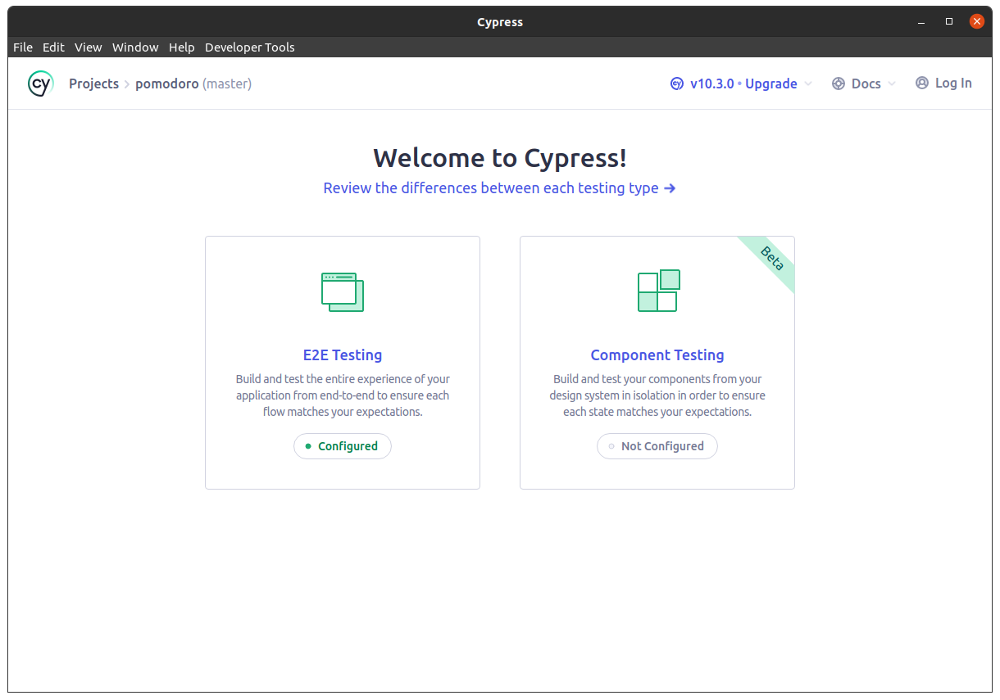
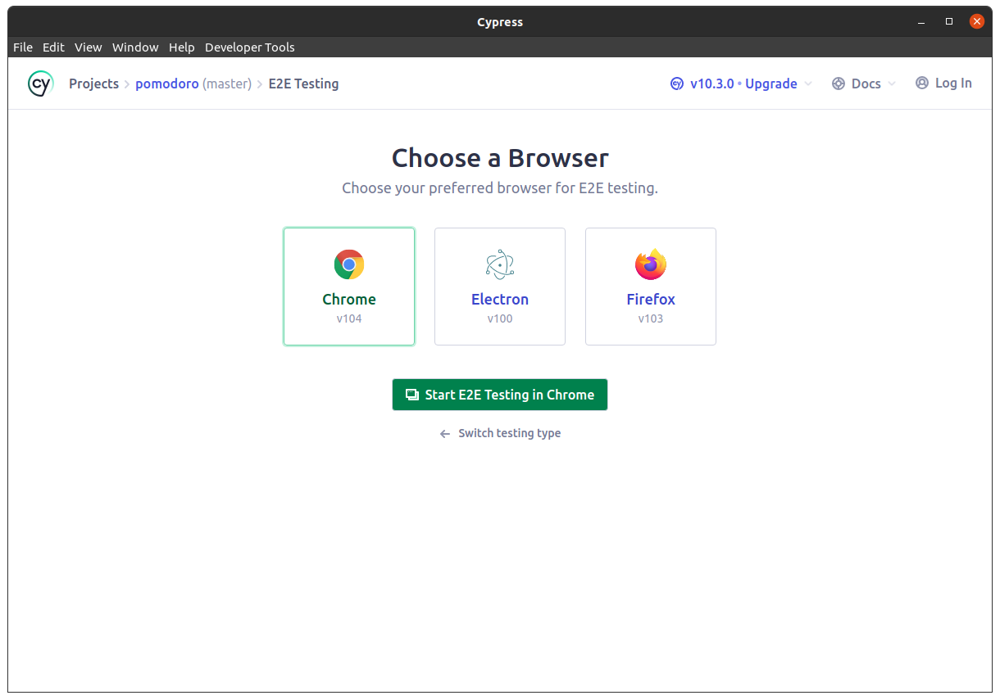
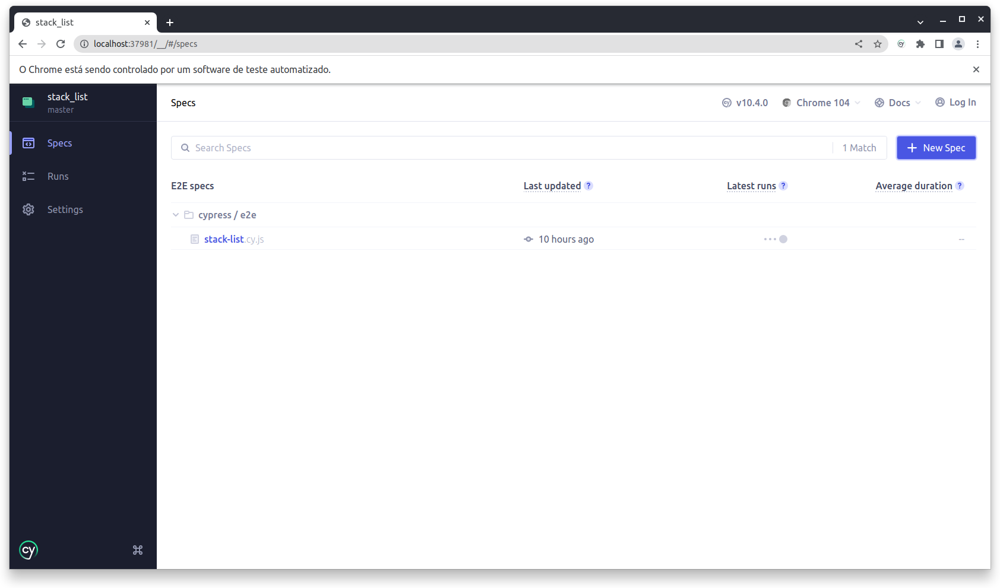
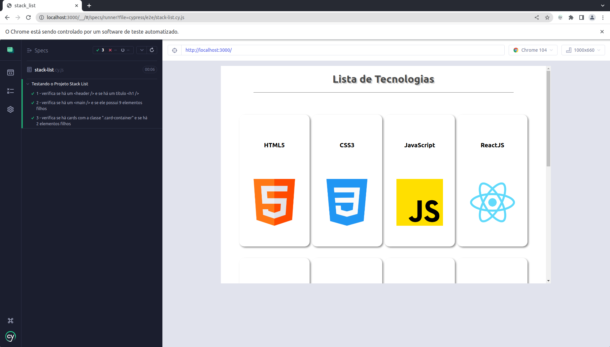
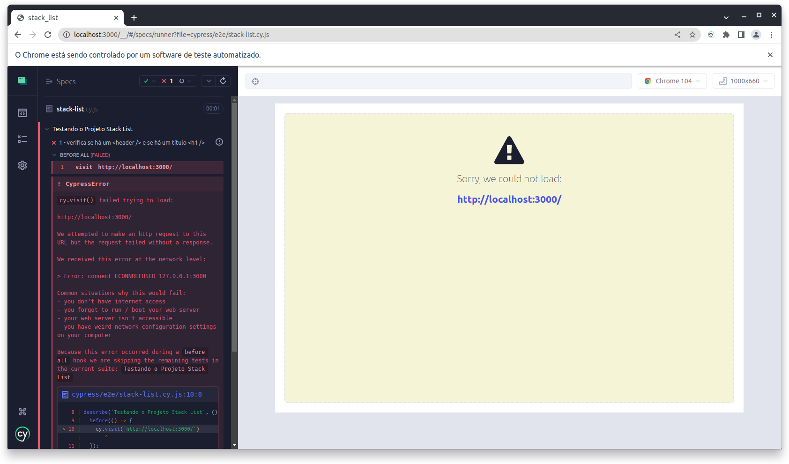
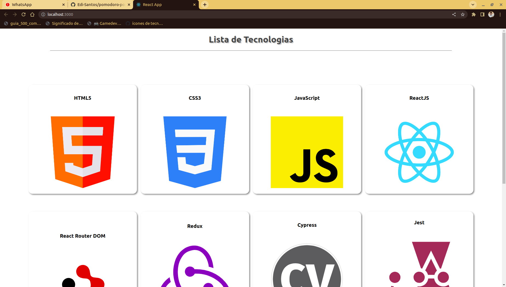

# Bem Vindo ao Projeto Stack List!!!

Este é o quarto projeto da iniciativa **_PorConta_**. Iniciativa que tem o propósito de ajudar aos novos programadores a começarem a desenvolver um _Portfólio_. Também ajudará aos que desejam pegar novos projetos para praticar e se aperfeiçoarem, estendendo, consequentenmente, ainda mais o Portfólio.
Fique a vontade para pegar os projetos e desenvolver à sua maneira, publicar no LinkedIn, mostrar para rescrutadores e tudo mais.

>*__Obs__*.: __LEIA ATENTAMENTE TODO O `README` ANTES DE COMEÇAR O DESENVOLVIMENTO DO PROJETO, POIS NELE ESTÃO CONTIDAS TODAS AS INFORMAÇÕES NECESSÁRIAS PARA O DESENVOLVIMENTO DO PROJETO.__

---

## Sumário
  - [Requisitos Para Desenvolver Este Projeto](#requisitos-para-desenvolver-este-projeto)
  - [Sobre o Projeto](#sobre-o-projeto)
     - [Tecnologias a Serem Utilizadas](#tecnologias-a-serem-utilizadas)
  - [Durante o Desenvolvimento](#durante-o-desenvolvimento)
     - [Mantendo Seu Código Versionado](#mantendo-seu-código-versionado)
  - [Desenvolvendo o Projeto](#desenvolvendo-o-projeto)
     - [Iniciando o Projeto](#iniciando-o-projeto)
     - [Instalando as Dependências](#instalando-as-dependências)
     - [Rodando os Testes](#rodando-os-testes)
  - [Requisitos do Projeto](#requisitos-do-projeto)
     - [Lista de Requisitos](#lista-de-requisitos)
       - [Tela de Relógio (index.html)](#tela-de-relógio-indexhtml)
         - [1 - Crie um Header](#1---crie-um-header)
         - [2 - Crie um Main](#2---crie-um-main)
         - [3 - Os cards devem possuir Nome e Imagem de uma tecnologia](#3---os-cards-devem-possuir-nome-e-imagem-de-uma-tecnologia)
---

### Requisitos Para Desenvolver Este Projeto

- VS Code
- NodeJS v14^

Para este projeto você precisa ter instalado em sua máquina um editor de código (sugiro o _VS Code_ pela sua simplicidade e leveza, além
de extensões que facilitam muito o desenvolvimento) e o Node na versão 14.0.0 ou superior.

Para saber qual versão do Node está rodando em sua máquina, abra o terminal e execute:

```
node --version
```

Caso precise mudar a versão do Node, uma opção é fazer uso do `NVM` para instalar novas versões e gerenciar as versões do Node em sua máquina.

Para saber se você tem o `NVM` instalado em sua máquina, abra o terminal e execute:

```
nvm --version
```

Você pode aprender mais sobre `NVM` <a href='https://github.com/nvm-sh/nvm'>aqui</a>

---

### Sobre o Projeto

Neste projeto você desenvolverá apenas uma tela que deverá possuir um *__header__* e um *__main__*. O objetivo deste projeto é de você desenvolver e consolidar seus conhecimentos em _HTML_, _CSS_ e _JS_, além de praticar a __lógica de programação__. Você fará este projeto em *__ReactJS__*. Busque componentizar ao máximo os elementos da página. Criar este hábito desde cedo te ajudará muito no aprendizado do _ReactJS_.

>__Obs.1__: Sinta-se à vontade para desenvolver o projeto bem à sua maneira, com suas características, mas vise sempre manter o código mais limpo e legível possível. Mantenha a organização de seus códigos.

>__Obs.2__: Na raiz do projeto há um diretório (pasta) chamada *__base_answer__*. Nesta pasta está um exemplo do projeto pronto desenvolvido por mim. A intenção é de você poder ter um lugar para que possa tirar alguma dúvida. Busque não se debruçar em cima do projeto pronto, tente fazer do seu jeito, pesquise quando surgir dúvidas, use este exemplo pronto apenas como último recurso.

#### Tecnologias a Serem Utilizadas

- __HTML__
- __CSS__
- __JavaScript__
- __ReactJS__

Fique à vontade para ir além e utilizar bibliotecas como, por exemplo, _Bootstrap_ e o jQuery.

---

### Durante o Desenvolvimento

#### Mantendo Seu Código Versionado

Busque fazer pequenos commits a cada nova funcionalidade do projeto implementada. </br>
É uma boa prática de mercado o uso de `commits semânticos`. Caso ainda não conheça esta prática, você pode começar a ler sobre eles <a href='https://medium.com/linkapi-solutions/conventional-commits-pattern-3778d1a1e657'>aqui</a>

---

### Desenvolvendo o Projeto

#### Iniciando o Projeto

Para dar o primeiro passo você precisa criar um _fork_ do projeto. Assim você estará puxando o projeto do meu repositório para o seu.

>__Obs.1__: Se você ainda não possui conhecimento sobre como o _fork_ funciona, leia <a href='https://docs.github.com/pt/get-started/quickstart/contributing-to-projects'>este guia</a> sobre _fork_ até a seção `Fazendo e enviando por push as alterações`. </br> Você pode ir além nos conhecimentos sobre _fork_ mas não serão necessários para este projeto.

>__Obs.2__: *__NÃO É NECESSÁRIO ABRIR UM PR (Pull Request)!!!__*

Feito o _fork_, clone o repositório para o seu computador

#### Instalando as Dependências

Para iniciar o projeto certifique-se de instalar as dependências.

Abra o seu terminal na raiz do projeto (o terminal do VS Code já abre na pasta que o VS Code foi aberto) e execute o comando:

```
npm install
```

Executado este comando, serão instaladas todas as dependências do projeto.

#### Rodando os Testes

Para os testes de Front-end nós estaremos utilizando o __Cypress__, uma poderosa ferramenta de testes para validação de telas. Ele acessa o código fonte ou URL e verifica, de acordo com os testes implementados, a existência ou não de elementos DOM. </br>
O mais importante aqui é que você saiba como executar estes testes para que possa desenvolver o projeto de acordo com o que se é pedido.

Antes de abrir o Cypress, é necessário que você rode a aplicação, pois o Cypress acessará a porta padrão que o ReactJS usa do localhost. Primeiro, execute:

```
npm start
```

Em seguida, para começar a testar, com seu terminal aberto na raiz do projeto, execute:

```
npm run test:cy
```

Aguarde um momento! O Cypress será iniciado (paciência... às vezes demora um pouco mesmo :grimacing:).

Após a inicialização do Cypress abrirá a seguinte tela:

> </br>

Escolha a opção `E2E Testing`, pois é esta que está configurada e com testes feitos.<br>
Em seguida, abrirá a seguinte tela:

>

Escolha alguma das 3 opções. A que você escolher será onde abrirá os testes do _Cypress_ e executará os testes.
Após selecionar a opção e clicar em `Start E2E Testing in ...`, abrirá a seguinte tela:

>

>__Obs__: Estarei utilizando a opção _Chrome_. 

Veja que temos 1 arquivo de teste (stack-list.cy.js).

> <br>

A tela mostrada acima é a tela que abrirá executando todos os testes presentes no arquivo *__stack-list.cy.js__*

Caso abrir o teste seja a primeira coisa que você faça, abrirá exatamente a tela mostrada no print abaixo.

> <br>

Conforme você for cumprindo cada requisito, você vai ganhando um *__check__* verde indicando o seu avanço.

---

### Requisitos do Projeto

>#### ATENÇÃO: HÁ, NA RAIZ DO PROJETO, UM ARQUIVO CHAMADO `datas.js`. ESTE ARQUIVO SIMULA A RESPOSTA DE UMA REQUISIÇÃO PARA UMA API. É UM ARQUIVO COM UM ARRAY DE OBJETOS (9 objetos) ONDE CADA OBJETO POSSUI DUAS CHAVES (_name_ e _imgPath_).

> *__Dica__*: Use um map() para percorrer e puxar as informações de cada objeto e renderizá-las na tela.

Faça com calma e atenção. Muito importante a __organização__ de seus códigos.

Ao concluir o projeto, ele deverá estar semelhante ao seguinte:

>

Mas fique à vontade para adicionar novas funcionalidades, mudar a aparência e demais coisas. A imagem acima é apenas um exemplo (o resultado do código da pasta _base_answer_)

---

>__Obs1__: Lembre-se de que há o projeto pronto dentro da pasta *__base_answer__* de onde você pode tirar dúvida, inclusive, olhar a estrutura de arquivos.

>__Obs2__: Para rodar o projeto da pasta *__base_answer__* você deverá navegar para dentro dela, através do seu terminal, e rodar o comando: `npm start`.

#### Lista de Requisitos

### 1 - Crie um Header

O `<header />` deve possuir um título com a TAG `<h1 />`.

##### O que será validado?

- Será validado que há uma TAG `<header />`;
- Será validado que o `<header />` possui uma TAG `<h1 />`.


### 2 - Crie um Main

O `<main />` deve possuir 9 cards.

##### O que será validado?

- Será validado que há uma TAG `<main />`;
- Será validado que a TAG `<main />` possui 9 elementos.

### 3 - Os cards devem possuir Nome e Imagem de uma tecnologia

Cada card deve conter as informações de um objeto do arquivo *__datas.js__* (cada objeto tem duas chaves: _name_ e _imgPath_). <br>
Cada card deve possuir, também, a classe `className='card-container'`.

##### O que será validado?

- Será validado que cada card possui a classe __card-container__;
- Será validado que cada card possui as informações de um objeto do arquivo *__datas.js__*.

---

### Considerações Finais

*__Parabéns por chegar até aqui e concluir o Projeto Pomodoro__*


## Muito obrigado pelo seu voto de confiança!

Acesse o nosso grupo do Discord para se manter atualizado com relação a novos projetos, interagir comigo e com outras pessoas, tirar suas dúvidas e ajudar outros colegas.

Link para o Discord: https://discord.gg/KN4uxuaYg6
